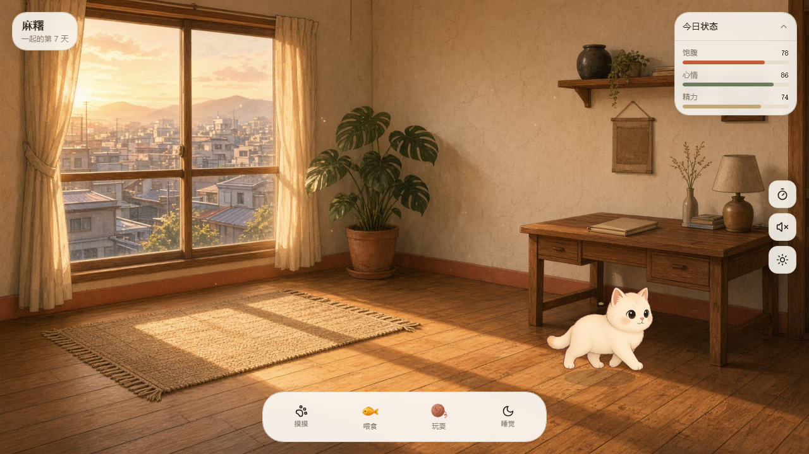
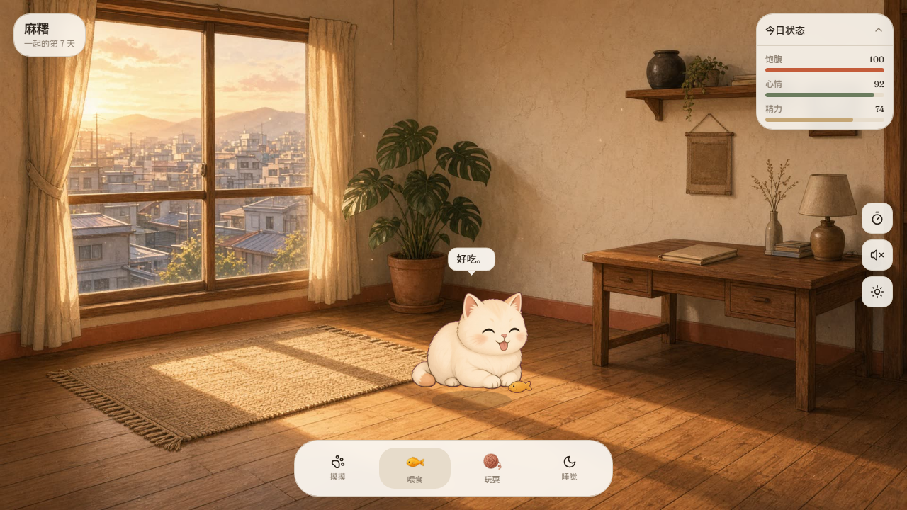
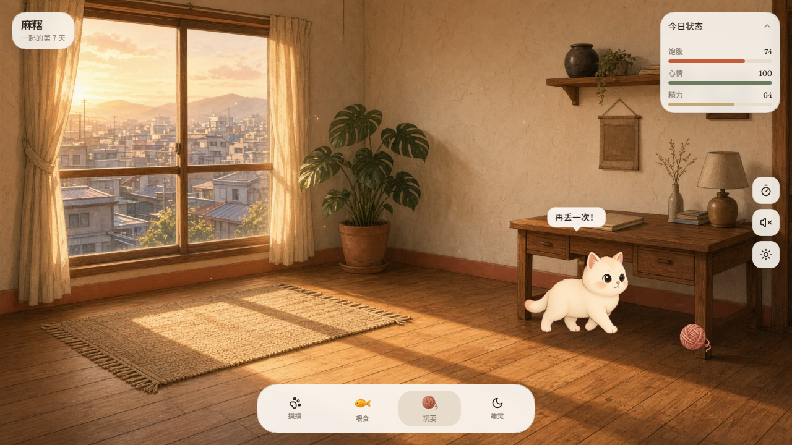
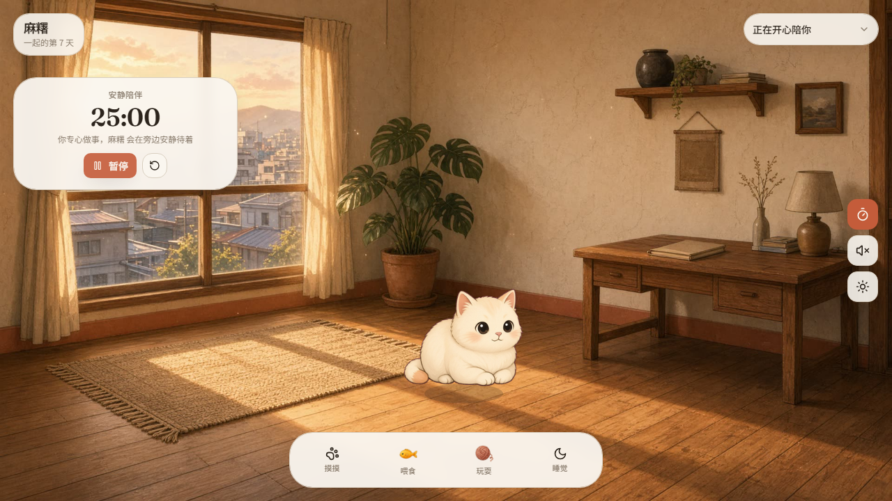
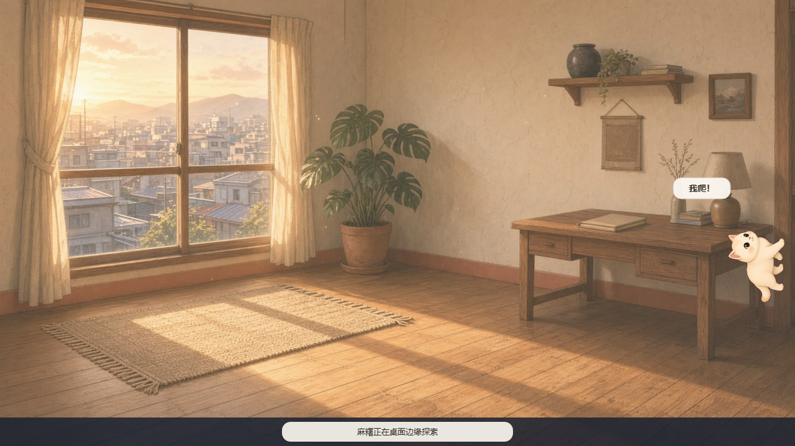

  
  <h1>窗边麻糬 · Mochi Desktop Pet</h1>
  
一只会散步、撒娇、玩耍，也会安静陪你工作的桌面小猫。

## 关于麻糬

窗边麻糬是一款温暖、轻量的桌面宠物陪伴软件。小猫拥有自己的饱腹、心情和精力状态，会在房间或电脑桌面上自由活动，也会根据你的照顾给出不同动作和回应。

网页版本提供完整的房间与照顾界面；本地桌面版本使用透明窗口悬浮在电脑桌面上，不会遮挡正常操作。它可以沿任务栏散步、被鼠标抱起，也会偶尔爬上屏幕边缘探索。

## 互动与状态

<table>
  <tr>
    <td width="50%"></td>
    <td width="50%"></td>
  </tr>
  <tr>
    <td align="center"><b>摸摸</b> 点击小猫提升心情，它会呼噜、撒娇并冒出爱心。</td>
    <td align="center"><b>喂食</b> 送上一条小鱼，恢复饱腹值并触发进食动画。</td>
  </tr>
  <tr>
    <td></td>
    <td></td>
  </tr>
  <tr>
    <td align="center"><b>玩耍</b> 抛出毛线球，小猫会跑过去追逐和扑抓。</td>
    <td align="center"><b>睡觉</b> 精力不足时让它打盹，恢复后可以轻轻叫醒。</td>
  </tr>
</table>

## 安静陪伴

开启 25 分钟安静陪伴模式后，麻糬会在旁边安静待着。计时结束时，它会主动提醒你休息一下，适合学习、写作、编码和日常办公。

## 真正住进电脑桌面

桌面版采用透明、始终置顶的窗口：

- 在任务栏上方自由散步，偶尔沿左右屏幕边缘向上爬。
- 左键点击可以摸摸，拖动可以把小猫抱起来。
- 右键小猫可喂食、玩耍、睡觉、切换声音或开启安静陪伴。
- 不与小猫互动时，鼠标点击会穿透透明区域，不影响桌面软件。
- 托盘图标可随时显示小猫或安全退出。

## 运行桌面版

1. 安装 [Node.js LTS](https://nodejs.org/)。
2. 下载并解压仓库中的 `public/MochiDesktop.zip`。
3. Windows 双击 `开始.bat`；macOS 双击 `start.command`。
4. 第一次运行会自动准备 Electron 组件，之后启动会更快。

## 技术栈

- React 19、TanStack Start、TypeScript、Tailwind CSS
- Canvas 2D 动画与帧率无关的交互循环
- Zustand 本地状态与离线衰减存档
- Electron 透明桌面窗口、托盘和鼠标穿透
- Web Audio API 生成轻量互动音效

## 隐私

小猫名字、状态和照顾记录默认只保存在本机。应用不会上传个人桌面内容，也不会修改系统设置；退出桌面宠物后透明窗口会完全关闭。

---

愿麻糬在每一次专注与休息之间，安静陪着你。

